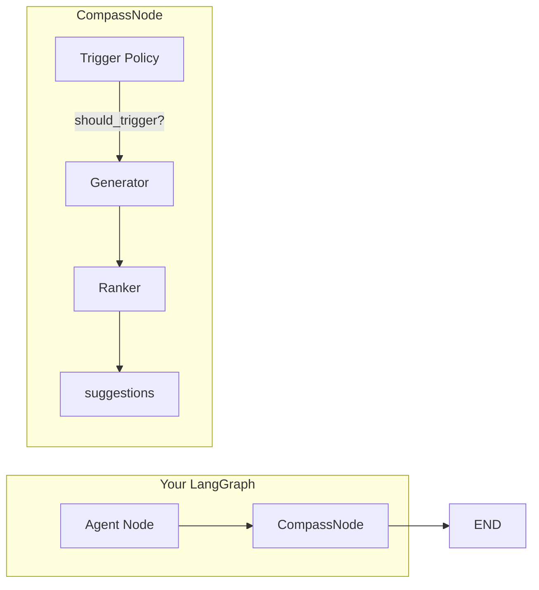

# Compass

[](https://pypi.org/project/langgraph-compass/)
[](https://pypi.org/project/langgraph-compass/)
[](LICENSE)

**Intelligent follow-up question generation for LangGraph agents.**

Transform your AI agents from reactive responders into proactive conversational partners. Compass generates contextually relevant follow-up questions that guide users toward productive outcomes. _Built and battle-tested at Cisco._

## Why Follow-Ups Matter

Great conversations don't just answer questions—they anticipate what comes next. Contextually relevant follow-ups:

- **Increase engagement** — Users who receive thoughtful follow-ups continue conversations 2-3x longer
- **Surface hidden needs** — Users often don't know what to ask; good follow-ups guide discovery
- **Catch misunderstandings early** — Clarifying questions prevent compounding errors
- **Drive business outcomes** — In support, sales, and onboarding, follow-ups guide users toward resolution

## The Problem with DIY

The naive approach looks simple:

```python
# Just add it to your prompt, right?
system_prompt = """
Answer the user's question.
At the end, suggest a follow-up question.
"""
```

**But this breaks down quickly:**

| Problem | What Happens |
|---------|--------------|
| No conditional logic | Suggests follow-ups after errors, guardrail blocks, or "goodbye" |
| No novelty tracking | Keeps suggesting the same things conversation after conversation |
| One-size-fits-all | Can't adapt strategy (clarify vs. explore vs. deepen) |
| Coupled to response | Can't run in parallel—adds latency to every response |
| Hard to tune | Logic buried in prompts, not configurable or testable |
| No separation of concerns | Follow-up logic tangled with agent logic |

## The Compass Solution

Compass is a dedicated LangGraph node that handles follow-up generation properly:

```python
from compass import CompassNode

compass = CompassNode(
    model=your_llm,
    strategy="adaptive",      # Automatically chooses clarifying/exploratory/deepening
    trigger=DefaultTriggerPolicy(
        skip_on_guardrail=True,   # Don't suggest after blocks
        min_response_length=50,   # Skip for short responses
    ),
)

# Add to your graph - that's it
builder.add_node("compass", compass)
builder.add_edge("agent", "compass")
```

**What you get:**

| Feature | Benefit |
|---------|---------|
| **Intelligent Triggers** | Skips follow-ups when inappropriate (guardrails, errors, greetings) |
| **Multi-Strategy Generation** | Adapts approach based on conversation context |
| **Novelty Filtering** | Never repeats similar suggestions |
| **Zero-Latency Patterns** | Run in parallel with your agent using `Send()` |
| **Organic Injection** | Weave follow-ups naturally into responses |
| **Full Observability** | Every generation traced in LangSmith |

## Installation

```bash
pip install langgraph-compass
```

## Quickstart

```python
from compass import CompassNode
from langgraph.graph import StateGraph, MessagesState, START, END
from langchain_openai import ChatOpenAI
from langchain_core.messages import HumanMessage

# 1. Create the node
compass = CompassNode(model=ChatOpenAI())

# 2. Add to your graph
builder = StateGraph(MessagesState)
builder.add_node("agent", your_agent)
builder.add_node("compass", compass)
builder.add_edge(START, "agent")
builder.add_edge("agent", "compass")
builder.add_edge("compass", END)

graph = builder.compile()

# 3. Suggestions appear in state
result = graph.invoke({"messages": [HumanMessage(content="What's the weather in SF?")]})
print(result["compass_suggestions"])
# ["Would you like me to compare this with yesterday's weather?"]
```

## How It Works



1. **Trigger Policy** — Decides if follow-ups should be generated (skip on guardrails, short responses, etc.)
2. **Generator** — Creates candidate questions using your chosen strategy
3. **Ranker** — Filters for novelty and diversity against conversation history

## Strategies

| Strategy | When to Use | Example Output |
|----------|-------------|----------------|
| `adaptive` | Default. Automatically chooses best approach. | Varies by context |
| `clarifying` | When responses might have ambiguities | "Would you like me to clarify the difference between X and Y?" |
| `exploratory` | When opening new directions | "Interested in exploring how this applies to Z?" |
| `deepening` | When more detail would help | "Should I dive deeper into the technical details?" |

## Advanced Patterns

### Zero-Latency Parallel Execution

Run Compass simultaneously with your agent—suggestions ready the moment your response is:

```python
from langgraph.types import Send

def route_parallel(state):
    return [
        Send("agent", state),
        Send("compass", state),  # Runs at the same time
    ]

builder.add_conditional_edges("plan", route_parallel)
```

### Organic Response Injection

Make follow-ups feel natural by weaving them into your agent's response:

```python
from compass import get_compass_instruction

def synthesize(state):
    instruction = get_compass_instruction(state)
    # Returns: "At the end of your response, naturally include..."

    prompt = f"Answer the question. {instruction}"
    return llm.invoke(prompt)
```

### Custom Trigger Policies

Control exactly when follow-ups are generated:

```python
class MyTriggerPolicy:
    def should_trigger(self, state: dict) -> bool:
        # Skip for greetings
        if state.get("intent") == "greeting":
            return False
        # Skip if user asked not to
        if "no follow-up" in state.get("query", "").lower():
            return False
        return True

compass = CompassNode(model=llm, trigger=MyTriggerPolicy())
```

### Domain-Specific Examples

Provide example questions from your domain for better results:

```python
class MyExampleRetriever:
    def retrieve(self, query: str, k: int = 5) -> list[str]:
        # MMR search for relevant but diverse examples
        return vector_store.max_marginal_relevance_search(query, k=k)

compass = CompassNode(model=llm, example_retriever=MyExampleRetriever())
```

## Integrations

### LangSmith Observability

Compass automatically integrates with LangSmith tracing. Every follow-up generation is logged with full context:

```python
# Just set your environment variables
# LANGCHAIN_TRACING_V2=true
# LANGCHAIN_API_KEY=your-key

# Compass nodes appear in your LangSmith traces automatically
# You can see: trigger decisions, generated candidates, ranking results
```

In LangSmith, you'll see:
- Whether the trigger fired and why
- The strategy used
- All candidate questions generated
- Which were filtered by the ranker
- The final suggestions returned

### User Feedback Loop

Track which follow-ups users engage with using LangSmith feedback:

```python
from langsmith import Client

client = Client()

# After user clicks/uses a follow-up
client.create_feedback(
    run_id=compass_run_id,  # From your trace
    key="followup_clicked",
    score=1,
    comment="User clicked: 'Would you like more details?'"
)

# Use this data to improve your prompts and strategies
```

### Personalization with LangMem

Integrate with [langmem](https://github.com/langchain-ai/langmem) to personalize follow-ups based on user preferences:

```python
from langmem import create_search_memory_tool
from langgraph.store.memory import InMemoryStore

store = InMemoryStore(index={"dims": 1536, "embed": "openai:text-embedding-3-small"})

class PersonalizedExampleRetriever:
    """Retrieves examples based on user's past preferences."""

    def __init__(self, store, user_id: str):
        self.store = store
        self.user_id = user_id

    def retrieve(self, query: str, k: int = 5) -> list[str]:
        # Search user's memory for preferences
        memories = self.store.search(
            ("memories", self.user_id),
            query=query,
        )

        # Adapt examples based on what we know about the user
        # e.g., if user prefers technical depth, return deeper examples
        user_style = self._extract_style(memories)
        return self._get_examples_for_style(query, user_style, k)

# Create personalized compass per user
compass = CompassNode(
    model=llm,
    example_retriever=PersonalizedExampleRetriever(store, user_id="user-123"),
)
```

## Configuration Reference

### CompassNode

```python
CompassNode(
    model: BaseChatModel,
    *,
    trigger: TriggerPolicy | None = None,          # When to generate (default: DefaultTriggerPolicy)
    strategy: Literal["adaptive", "clarifying", "exploratory", "deepening"] = "adaptive",
    max_suggestions: int = 1,                       # How many to return
    starters: list[str] | None = None,              # Approved starter phrases
    output_key: str = "compass_suggestions",        # State key for output
    inject_into_messages: bool = False,             # Also add to messages
    query_key: str | None = None,                   # State key for query (auto-detected)
    response_key: str | None = None,                # State key for response (auto-detected)
    messages_key: str = "messages",                 # State key for message history
    example_retriever: ExampleRetriever | None = None,  # Domain examples
    generate_candidates: int = 3,                   # Candidates before ranking
)
```

### DefaultTriggerPolicy

```python
DefaultTriggerPolicy(
    *,
    skip_on_guardrail: bool = True,                 # Skip if guardrails fired
    skip_classifications: list[str] | None = None, # Query types to skip
    require_agent_response: bool = True,            # Need substantive response
    min_response_length: int = 50,                  # Minimum chars to trigger
    custom_skip_keys: list[str] | None = None,      # Additional state keys to check
)
```

### Helper Functions

```python
from compass import get_compass_instruction, extract_previous_followups

# Get instruction for prompt injection
instruction = get_compass_instruction(state, suggestion_key="compass_suggestions")

# Extract previous follow-ups for custom novelty logic
previous = extract_previous_followups(messages, starters=None, max_history=5)
```

## Examples

See the [examples/](examples/) directory:

- `quickstart.py` — Minimal working example
- `parallel_execution.py` — Zero-latency pattern with `Send()`
- `inject_into_response.py` — Organic follow-up injection

## Development

See [CONTRIBUTING.md](CONTRIBUTING.md) for development setup and guidelines.

```bash
# Quick setup
uv sync --all-extras
uv run pre-commit install

# Run tests
uv run pytest

# Lint & type check
uv run ruff check src tests
uv run mypy src
```

## License

Apache 2.0
